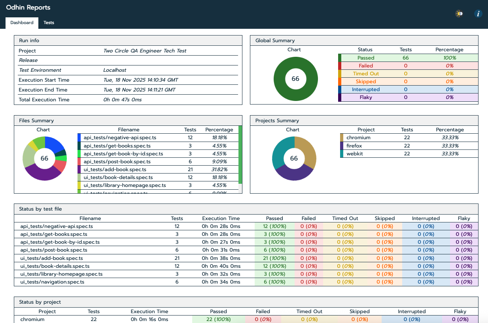

# Test Approach — Books Library Application

This document briefly describes how I approached testing the Books Library application.

---

## ✅ Overview

The testing focuses on verifying:

- Core UI workflows (Add Book, View Details, Navigation)
- Basic API behavior (GET and POST endpoints)
- Negative scenarios (missing fields, invalid IDs, invalid pages value)
- Ensuring all default books match the expected dataset

---

## 🧪 UI Testing Approach (Playwright)

- Validated all primary flows:
  - Add New Book (required fields + all fields)
  - View details from homepage
  - Navigate back using both (← link and button)
  - Access details page directly using URL
  - Validate field-level error messages via browser’s `validationMessage`
- Confirmed the success banner and navigation after adding books
- Ensured newly created books appear correctly in the list and details pages
- Verified details page matches expected data from `booksData.ts`

### Artifacts captured:
- Screenshots (on failure)
- Videos (on failure)
- Traces (on failure)

---

## 🌐 API Testing Approach (Playwright APIRequestContext)

- Tested `GET /api/books` returns all books
- Tested `GET /api/books/:id` returns specific book
- Tested `POST /api/books` creates new books using:
  - Required fields
  - Full payload
- Negative tests:
  - Missing required fields → **400**
  - Invalid book ID → **404**
  - Using only optional fields in POST → **400**

---

## 📦 booksData.ts (Default Books Data)

I created a dedicated `booksData.ts` file containing the canonical list of default books:

- title  
- author  
- genre  
- year  
- pages  
- description  
- isbn  

This file:

- Ensures consistent validation across UI + API  
- Allows matching each book by **title** (mandatory and unique field)

---

## 📊 Odhin Report

A screenshot of the full Odhin test report is included in the submission, showing:

- Total test count  
- Grouped results (E2E, API Positive, API Negative)  
- All tests passed successfully  
- Execution time per test  

📎 

> Note: To install Odhin reports use  
> `npm i -D odhin-reports-playwright --save --save-exact`

---